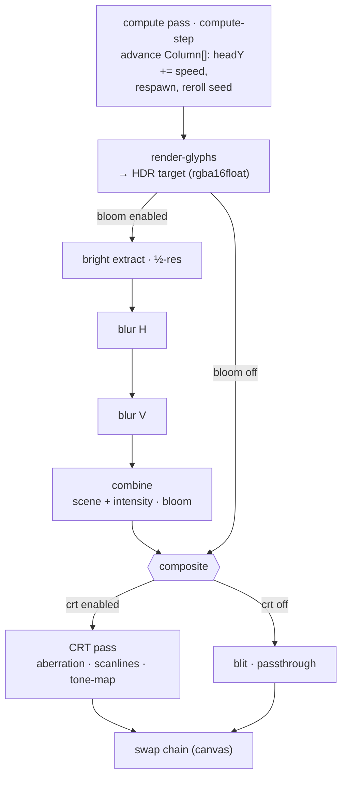

The effect is orchestrated by a single render graph (`src/gpu/render-graph.ts`) that owns the GPU resources and runs two things each frame: a **compute pass** that advances the simulation, and a **render pass chain** that draws the frame and applies post-processing.

## Per frame

## The passes

1. **Compute (`pipelines/compute-step.ts`)** — reads/writes the `Column[]` storage buffer, advancing each column's head and handling respawn. Dispatched on a fixed logical cadence (`stepRate` Hz), decoupled from the render frame rate.
2. **Glyph render (`pipelines/render-glyphs.ts`)** — a full-screen fragment pass that, per pixel, figures out which column/cell it's in, samples the SDF atlas for that cell's glyph, and shades it (head/trail color, brightness falloff, depth dimming). Draws into a full-res **HDR** target (`rgba16float`) so bloom has headroom.
3. **Bloom (`pipelines/bloom.ts`)**, when enabled — extract bright pixels at half-res, blur them with a **separable Gaussian** (horizontal then vertical), and combine `scene + intensity·bloom`.
4. **Final pass** — **CRT (`pipelines/crt.ts`)** when enabled (chromatic aberration + scanlines + tone-map), otherwise a plain **blit (`pipelines/blit.ts`)**, writing to the swap chain.

## Why HDR in the middle

Glyphs render into an `rgba16float` target rather than straight to the canvas so bright heads can exceed 1.0 and the bloom + tone-map steps have real range to work with. The CRT/blit pass is what finally maps the composite into the 8-bit swap chain.

## Resource lifecycle

Most resources (atlas texture, sampler, pipelines, uniform buffer) are created **once** at graph construction. Only the size-dependent targets (HDR, the half-res bloom targets, the combine target) are recreated, and only when the canvas size actually changes — `resize()` runs every frame but is a no-op unless dimensions changed. The `Column[]` buffer is reallocated only when the column count changes (a width change).

See [Data model](/matrix-rain-webgpu/architecture/data-model/) for the buffers, and the **How it works** pages for each pass in depth.
